# 植物大战僵尸 Decomp 官方文档 V1.8.5（中文翻译与扩写版）

> **文档来源**：本中文版基于英文原版 *The OFFICIAL PVZ Decomp DOC V.1.8.5* 翻译并扩写。
> 英文原版由 **Discord 用户 `scarletstarz2009`** 编写。
> 翻译与扩写由 **豆包（Doubao）** 完成，**提示词与测试环境由用户提供**。
> 本文档所针对的 Decomp 源码来自 Discord 社区 **「Plants Vs. Zombies 1 Modders Association」**。

> ⚠️ **关于 "OFFICIAL" 一词**：本文标题沿用了英文原版的原始标题（*The OFFICIAL PVZ Decomp DOC*）。这里的 "OFFICIAL" 是**该社区文档自身使用的标题**，本中文版仅是照原文保留，**不代表 PopCap / EA 官方出版物**。本文实为 **PvZ1 Modders Association / 社区维护的 PvZ1 Decomp / Modding 文档**。

> 📌 **分支适用说明**：本文是 `main`（ZH）与 `OG_Only` 两个分支**共用**的基础 Modding 手册。文中凡涉及 `Debug-GOTY` / `Release-GOTY` 配置、中文 PAK、`PVZ_GOTY_ZH_PAK` 宏、2012 中文年度版等**中文化内容，仅适用于 `main`（ZH）分支**；`OG_Only` 分支只提供 `Debug` / `Release` 两个配置，且**不含**任何中文化渲染改动。若你在 `OG_Only` 分支下看到这些内容，属于正常现象，它们并不存在于该分支。

---

## 目录

- [第 1 章 简介与更新说明](#第-1-章-简介与更新说明)
- [第 2 章 你需要准备的资源](#第-2-章-你需要准备的资源)
- [第 3 章 植物相关](#第-3-章-植物相关)
- [第 4 章 僵尸相关](#第-4-章-僵尸相关)
- [第 5 章 综合（植物 / 僵尸）](#第-5-章-综合植物--僵尸)
- [第 6 章 其他](#第-6-章-其他)
- [第 7 章 如何重新编译 LawnProject](#第-7-章-如何重新编译-lawnproject)
- [第 8 章 服务器上发现的 Bug 修复](#第-8-章-服务器上发现的-bug-修复)
- [第 9 章 成员致谢](#第-9-章-成员致谢)
- [附录 A：如何编译（分支与命令行）以及编译失败处理](#附录-a如何编译分支与命令行以及编译失败处理)
- [附录 B：reanim 命名差异（重要）](#附录-breanim-命名差异重要)
- [附录 C：中文化（整包加载中文 PAK）](#附录-c中文化整包加载中文-pak)

---

## 第 1 章 简介与更新说明

这份文档用来帮助你处理一些基础性的修改工作 🙂。

**文档版本：V.1.8.5（新更新）**

**更新内容：**

- 文档优化（Doc Optimization）
- 新增背景制作教程（Adding New Backgrounds）
- 其他内容（Others）

---

## 第 2 章 你需要准备的资源


### Visual Studio 2022

下载地址：https://visualstudio.microsoft.com/downloads/

### 以及……

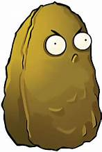
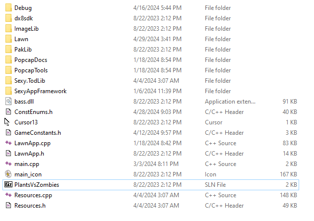

**Decompiled Plants VS Zombies（反编译版植物大战僵尸）**

> **本教程使用的仓库（推荐）：** https://github.com/Adnini983/PVZ1MA-Decomp-ZH
> 该 Decomp 最初的源码来自 Discord 社区 **「Plants Vs. Zombies 1 Modders Association」**。

> **注意：** 下面的 `drive.google.com` 链接是**修改前的原始源码**（供对照 / 从零开始用）；本教程针对的 Decomp 版本请优先使用上面的 GitHub 仓库。

下载地址（修改前的原始源码）：

https://drive.google.com/file/d/1blVj5Ulq_SqbPf8WiLzflIHRM5KckPPz/view?usp=sharing

---

## 第 3 章 植物相关


### 3.1 植物阳光消耗与冷却

#### 阳光消耗

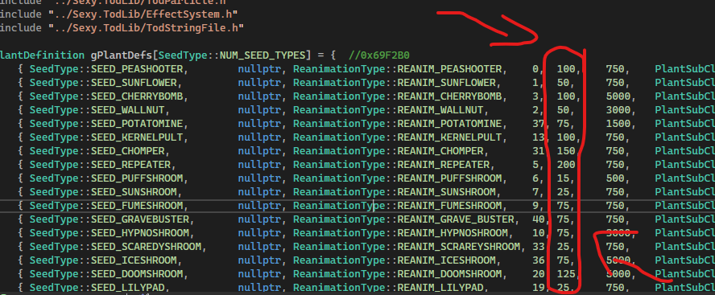


要实现这一点，你需要打开 `Plant.cpp`，向下滚动一点，就能在这里**修改这些数字**——它们表示该植物消耗多少阳光。

#### 冷却时间

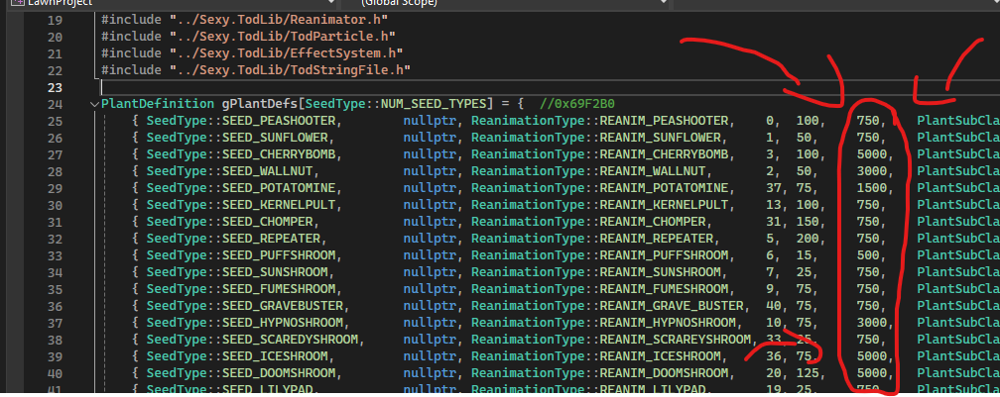

如果你想修改植物的冷却时间，修改这里的数字即可。

### 3.2 植物生命值


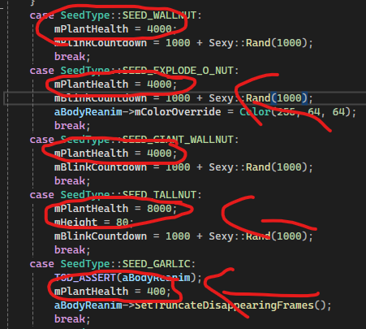
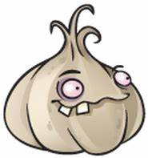


如果你想修改植物的生命值，请在 `Plant.cpp` 中找到 `PlantInitialize()`，然后修改这里：


如果某个植物没有这段代码，直接**添加一行**进去就行（`¯\_(ツ)_/¯`）。

**示例：** `mPlantHealth = (生命值数量);`

### 3.3 植物射速

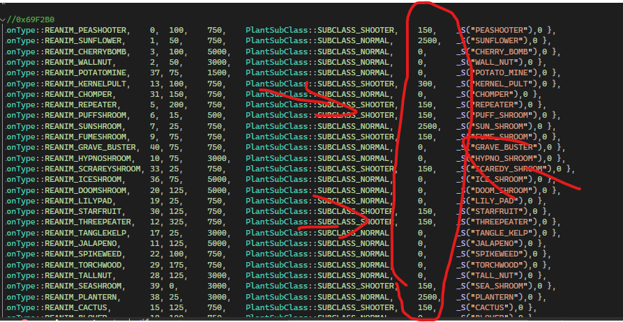


要修改豌豆射手、加特林豌豆或其他植物的射速，只需进入 `plant.cpp` 修改这些数字。


**它表示植物开火的速度。**

### 3.4 如何创建你自己的植物

视频链接：

https://youtu.be/zCreWdPBDOs?si=n1OBBQS7HedVC80O


上面是 M.A（Modders Association，模组作者协会）制作的一个关于如何创建自己植物的视频。建议你加入他们的 Discord 服务器，他们在许多模组制作问题上都能帮上忙。

希望这个视频对你有帮助。

### 3.5 植物发射什么投射物

进入 `Plant.cpp` 并定位到第 4632 行。如果你看不到行号，可以到 YouTube 上搜索如何在 Visual Studio 中开启行号显示。

（这个视频会教你如何在 Visual Studio 开启行号：）

https://www.youtube.com/watch?v=k3XkNQclQ60

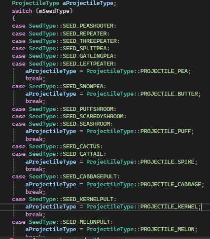

现在你就能修改游戏中每一种植物的投射物了。

### 3.6 植物升级

在 `Plant.cpp` 中找到 `IsUpgrade()` 函数，把你的植物加进去。

然后进入 `IsUpgradableTo()` 函数，把"可被升级的植物"和"升级后的植物"都加进去（**第一个 ID 表示可被升级的植物，最后一个 ID 表示升级后变成的植物**）。

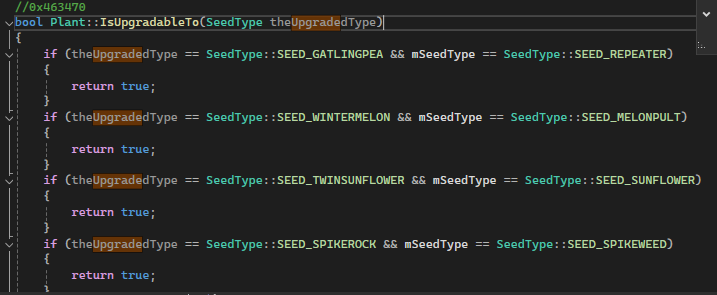

非常简单！

### 3.7 如何给植物附加冰冻效果

（致谢：代码来自 Samen，由 ZooWeeMinecraft 分享）

**第一步**：在 `plants.h` 中添加这些声明：

(1) 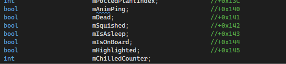

(2) 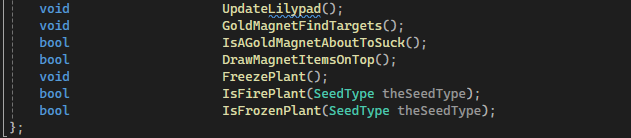

**第二步**：进入 `plant.cpp`，在 `PlantInitialize` 中添加：

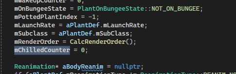

**第三步**：在 `UpdateReanimColor()` 中添加：

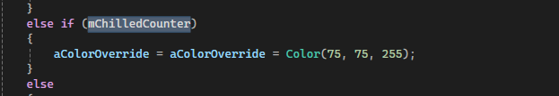

（如果你想用更浅的颜色，也可以选择 100、160、255）

**第四步**：在 `Plant::Update()` 中添加这两处：

(1) 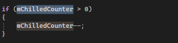

(2) 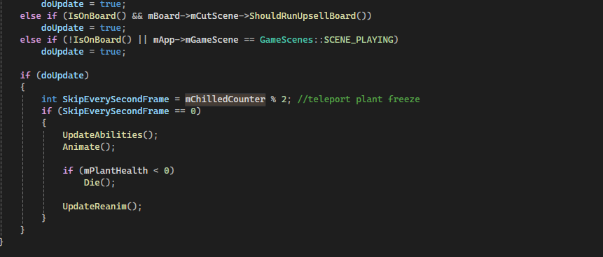

**第五步**：添加这个方法：

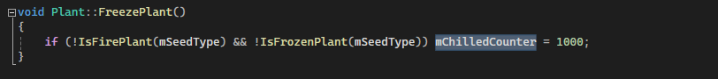

**第六步**：添加最后这两个方法：

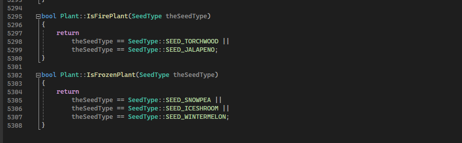

**最后**：如果你想把这些效果应用到僵尸的投射物上，进入 `Projectile.cpp` 添加：

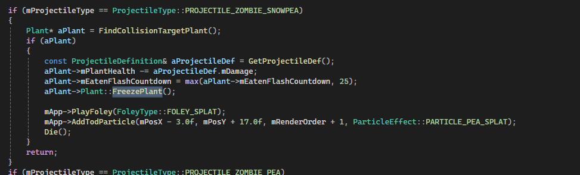

或者，如果你想让植物在放置后**限时**拥有冰冻效果，就在 `PlantInitialize` 中给任意植物添加 `FreezePlant();`。

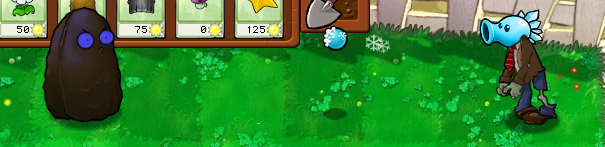

这样你就得到了一个带冰冻投射物的僵尸，或者一个放置后就自动带冰冻效果的植物！

### 3.8 让植物水生 / 白天睡觉

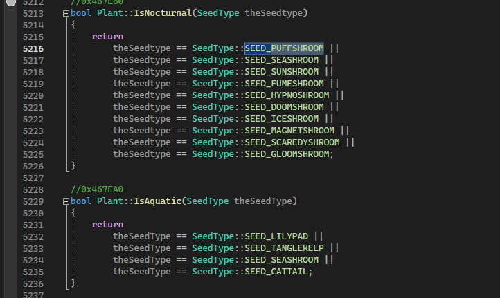

（本小节原文以截图示意，具体在 `Plant.cpp` / 相关函数中调整 `mIsAquatic` 与睡眠相关逻辑。）

### 3.9 修改植物的攻击矩形（Attack Rect）

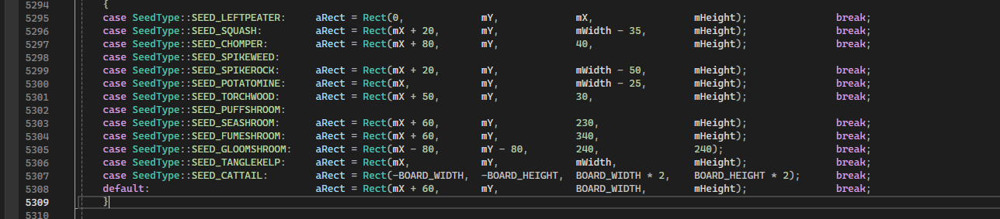

**植物攻击矩形（Plant rects）** 定义了植物周围可以与其他对象（如僵尸或投射物）互动或影响的区域/范围。

### 3.10 土豆雷 3×3 区域爆炸

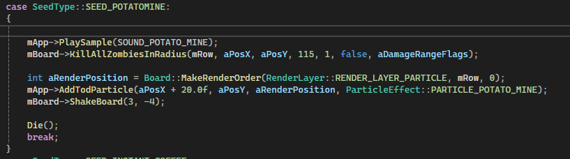

---

## 第 4 章 僵尸相关

### 4.1 僵尸波数（冒险模式）

`gZombieWaves()` 定义了某个冒险关卡中的波数。

每隔 10 波会出现一波巨型波（Huge Wave），通常关卡会在巨型波处结束；不过不能被 10 整除的数字同样可以生效。

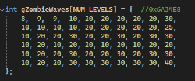

`gZombieWaves` 可以在 `Challenge.cpp` 中找到。

### 4.2 冒险模式生成（Adventure Spawns）

打开 `Challenge.cpp` 并向下滚动，你会看到这些东西：

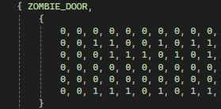

- `0` = 表示该僵尸不在这个关卡中
- `1` = 表示该僵尸在这个关卡中

你还需要进入 `Zombie.cpp` 修改这里：

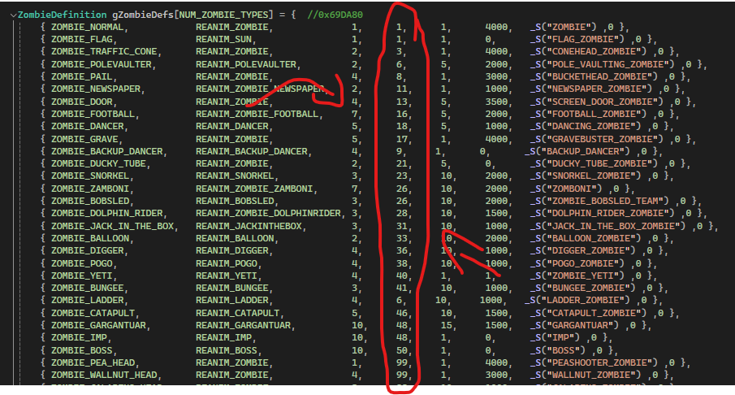

这些数字表示僵尸在**第几关被引入**，别忘了修改这里。

- `99` = 表示该僵尸不在冒险模式中

### 4.3 僵尸生成速率

要修改僵尸的生成速率，进入 `Board.cpp` 定位到第 669 行，或进入 `PickZombieWaves()`。

你可以修改这些僵尸点数（Zombie Points）：

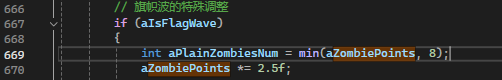

`aZombiePoints`

### 4.4 修改僵尸王（Zomboss）的生成

进入 `Zombie.cpp` 并定位到第 56 行（`gBossZombieList`）：

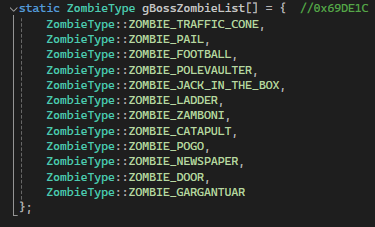

现在你可以修改僵尸类型，或者添加一个新的。随你喜欢。

### 4.5 僵尸生命值

要修改僵尸的生命值，进入 `Zombie.cpp`，找到 `ZombieInitialize`（或向下滚动）。

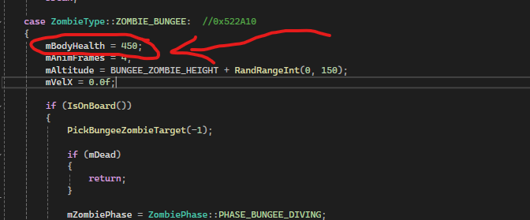

现在你可以修改 `mBodyHealth` 来设置僵尸的 HP。

如果某个僵尸没有 `mBodyHealth` 代码，直接新建一行并添加它。

**示例：** `mBodyHealth = (生命值数量);`

### 4.6 僵尸速度

要修改僵尸的速度，进入 `zombie.cpp`，找到 `PickRandomSpeed`。

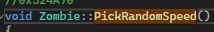

这里就是修改僵尸速度的地方。

请记住，**并非每个僵尸都在 `PickRandomSpeed()` 中**，所以你可以通过复制粘贴代码并修改 ID 的方式把它们加进去。

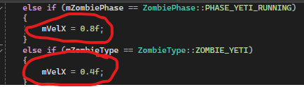

### 4.7 僵尸护甲生命值

进入 `zombie.cpp`，找到 `ZombieInitialize()`（或向下滚动）。

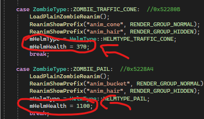

现在你可以修改护甲生命值并设置它们的 HP。

**示例：** `HelmHealth = (护甲生命值数量);`

### 4.8 给僵尸加装甲（cone 锥帽 / bucket 铁桶）

要给僵尸加锥帽或铁桶，你需要进入 `zombie.cpp` 找到 `ZombieInitialize()`。

我将以**旗帜僵尸（Flag Zombie）**为例。现在你需要新建一行并添加代码：`mHelmType = `，然后选择你的头盔类型。

**头盔类型（HELMET TYPES）：**

`HELMTYPE_TRAFFIC_CONE`、`HELMTYPE_PAIL`、`HELMTYPE_TALLNUT`、`HELMTYPE_WALLNUT`、`HELMTYPE_FOOTBALL`（还有更多头盔，如果想查看完整列表，它们在 `ConstEnums.h` 中列出）

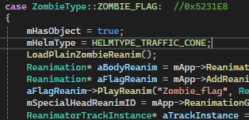

**示例：** `mHelmType = HELMTYPE_(你的头盔类型);`

别忘了还要设置 `mHelmHealth`，用它来**指定护甲拥有多少生命值**。

### 4.9 让其他僵尸可以进入水池

进入 `Zombie.cpp` 找到函数 `ZombieTypeCanGoInPool()`：

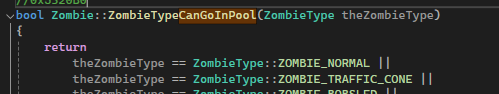

把你的僵尸添加在该函数下方。

### 4.10 巨人僵尸（Gargantuar）投掷什么

> ⚠️ **尚未测试**，可能会导致崩溃！说实话我有点懒。

进入 `Zombie.cpp` 找到函数 `UpdateZombieGargantuar()`：

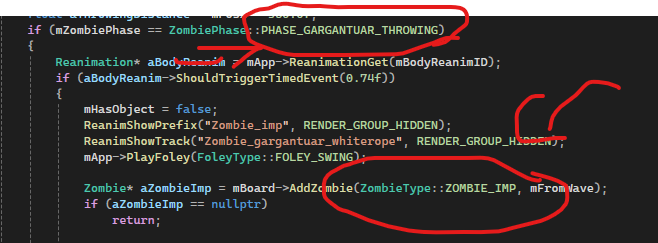

找到这个阶段：`PHASE_GARGANTUAR_THROWING`

把 `ZOMBIE_IMP` 的 ID 改成你想要的任何东西。这个还没有经过测试，所以如果导致崩溃，我建议你去找其他与小鬼（Imp）相关的引用（我个人认为它不会崩）。

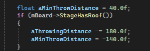

你还可以修改下方的**投掷距离**（Throwing Distance），这个我也没试过，但你可以试试。

### 4.11 允许梯子放在其他植物上

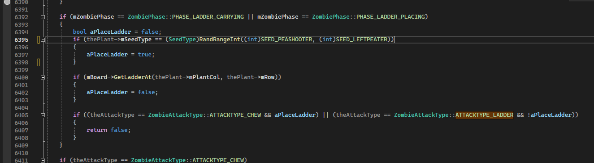
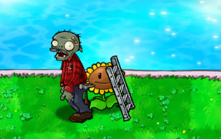

---

## 第 5 章 综合（植物 / 僵尸）

### 5.1 植物 / 僵尸动画（reanim）

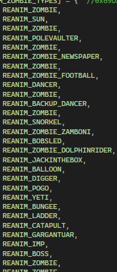
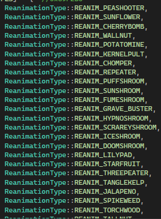

这些是植物和僵尸拥有的 reanim 动画。要看完整的 Reanim 列表，可以在 `ConstEnums.h` 中找到。你可以随意修改它们。

> **⚠️ 重要提醒（reanim 命名差异）**：请参见[附录 B：reanim 命名差异](#附录-breanim-命名差异重要)。

### 5.2 有限穿透投射物教程

（放在这里是因为僵尸和植物都可以发射投射物）

（致谢：imjoniii）

在 `projectile.h` 中添加：

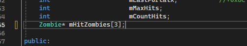

接下来在 `projectile.cpp` 的 `projectileinitialize` 函数中添加：

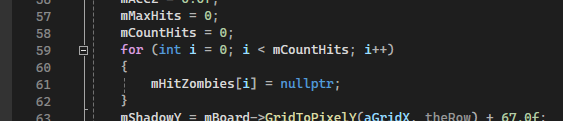

接下来在 `FindCollisionTarget` 中添加：

(1) 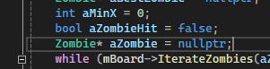

以及这个：

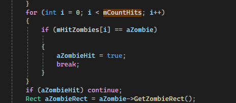

最后在 `DoImpact` 中添加：

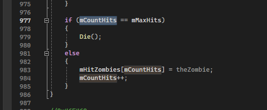

接下来，为了给投射物附加穿透效果，在 `DoImpact` 中添加：

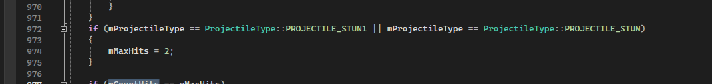

或者在 `Plant.cpp` 的 `Plant::Fire` 函数中添加这个：

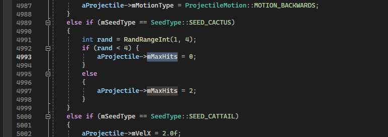

### 5.3 无限穿透投射物教程

（放在这里是因为僵尸和植物都可以发射投射物）

（致谢：Drunken）

首先在 `projectile.h` 中添加：

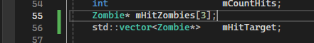

接下来在 `projectile.cpp` 的 `FindCollisionTarget` 中添加：

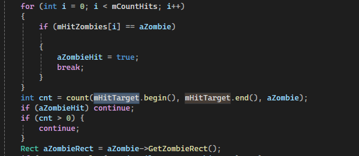

最后在 `DoImpact` 函数中添加：

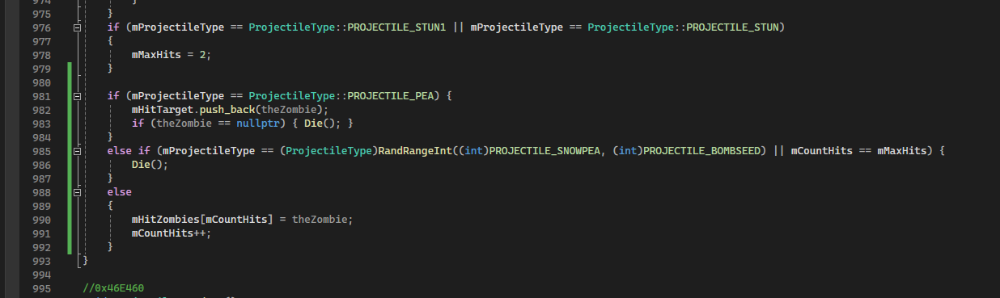

**快速提示：** 把你的投射物加在 `projectile_pea` 之上，这样你才能这样做：

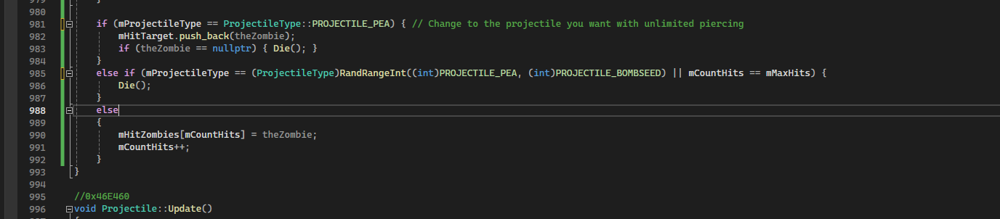

### 5.4 新增投射物

首先进入 `constenums`，搜索 reanim，在 reanim 相关代码上方向上滚动直到找到投射物，把你的投射物加在那里，并把投射物总数改成你添加的数量——例如我添加了 1 个投射物，就把总数加 1。这里有个例子：


接下来打开 `Projectile.cpp`，指明你的投射物会造成多少伤害：


**（第二个数字表示伤害值）**

接下来，如果是**抛物线投射物**，搜索所有出现 `PROJECTILE_CABBAGE` 的地方，把你的投射物加进去，并记得把它应用到你的植物上。

还有一点：进入 `plant.cpp` 搜索 `lobbed`：


向上滚动，把你的植物放进去。

如果是**直线投射物**，搜索所有出现 `PROJECTILE_PEA` 的地方，然后把你的投射物加进去，再应用到你的植物上。

最后一步，要把投射物应用到你的植物上，进入 `void Plant::Fire()`，通过以下方式应用：

```cpp
case SeedType::[你的植物]:
    aProjectileType = ProjectileType::[你的投射物];
    break;
```

这是我的例子：


以上就是新增投射物的基础。

（另注：从 V.13 开始，`constenums` 中的顺序必须与 `projectile.cpp` 中的顺序一致）

**（V.13 更新，我忘了写在这里）：**

一种让新植物产生诸如冰冻等效果，或添加毒、阳光效果（？）、影系植物效果的方法：进入 `GetDamageRangeFlags`：


然后在 freeze 或相应效果中，把你的投射物加进去，就像我这样。这里其实没什么好说的。

### 5.5 其他效果（GetDamageRangeFlags）

见上文 5.4 末尾的 V.13 更新说明。

---

## 第 6 章 其他

### 6.1 新增一个背景

**决定背景名称。** 这段代码位于 `ConstEnums.h`：


**为你的背景创建一张自定义图片。** 这一步在技术上可选。

游戏本体位于 `Debug` 或 `Release` 文件夹中——选你游戏所在的那个。如果你不确定，大概率是 `Debug`。


把你的图片放进 `images`，然后在 `properties` 中找到名为 `resources.xml` 的文件：


在 `resources.xml` 上，创建一个新的资源 ID，并把图片的文件名放进路径里。下面是我第 7 号背景的例子：


**让游戏读取你的图片。**

在 `resources.h` 中添加以下内容：

（标注了 COVER 的只适用于宽屏版本的反编译）


在 `resources.cpp` 中添加以下内容：


我把这段加在了 `ExtractDelayLoad_Background4Resources` 之后：


`Board.cpp`：


**为新的背景应用属性。**

你制作了一个新背景！现在让我们给它应用属性。

`PickBackground()` 中的这段代码定义了哪些行是普通行、可种植行、水行、不可种植行：


由于我们的背景有 5 行（你可以很容易地通过把你的背景加进 `StageHas6Rows()` 之一来改变这一点），所以 `mPlantRow[5]` 是 dirt（泥土）。


这个函数用于定义背景是否属于夜晚，它让蘑菇在开局时不必睡觉、阳光也不会从天空掉落：


下面是定义背景属性的另外三个函数。注意其中两个函数会改变背景的渲染方式：

- `StageHasRoof()` 让植物与屋顶对齐。
- `StageHasPool()` 绘制水池，并重新排列植物对齐方式以适配第 6 行。


这是因为下面这段代码检查的是场景是否**有水池**，而不是**有 6 行**：


要把你的新背景添加到冒险模式，进入 `PickBackground()`，添加一个检查 `mLevel` 是否处于某个特定世界附近的 `if` 语句（数字表示它所在的世界）：


我把我的世界放在了白天（Day）和夜晚（Night）之间。请相应地修改 `GameConstants.h` 中的 `ADVENTURE_AREAS`。

**`Cutscene.cpp`：**


`StartLevelIntro()` 中的这段代码用于定制开场信息。如果你的背景处于冒险关卡中，就必须在这里处理它——如果你不想让游戏（人为地）崩溃，就把它包含在下面这些选项之一中。

### 6.2 修改美术挑战（Art Challenges）

进入 `Challenge.cpp` 并定位到第 261 行（或向下滚动）：


这里就是你可以修改所有美术挑战的地方：

- 坚果墙美术挑战（Art Challenge Wallnut）
- 向日葵美术挑战（Art Challenge Sunflower）
- 杨桃美术挑战（Art Challenge Starfruit）

### 6.3 新增世界 + 让植物可通过冒险解锁

（致谢：是 81_zsa 和 flagbearer 让这成为可能）

进入 `gameconstants.h` 搜索 `ADVENTURE_AREAS = 5`，把 5 改成 6。

接下来在 `board.cpp` 搜索：

```cpp
mNumWaves = gZombieWaves[ClampInt(mLevel - 1, 0, 49)];
```

把 49 改成 59；同时还有：

```cpp
return gZombieAllowedLevels[theZombieType].mAllowedOnLevel[ClampInt(theLevel - 1, 0, 49)];
```

把 49 再改成 59。接着在 `challenge.h` 中搜索：

```cpp
int mAllowedOnLevel[50];
```

把 50 改成 60。然后进入 `challenge.cpp`，在那里添加一行新的僵尸和僵尸波数。例如：


例(2)：


很容易对吧？

**现在让植物可通过冒险解锁：**

首先进入 `zombie.cpp`，搜索 `ZOMBIE_BOSS`，找到数字 50 并改成 60。例如：


接下来在 `challenge.cpp` 中，在下面这段之后：


添加：

```cpp
else if (mApp->IsAdventureMode() && mApp->mPlayerInfo->mLevel == 50)
{
    aSeedPickCount = 9;
    aSeedPickArray[0].mItem = SEED_FLOWERPOT;
    aSeedPickArray[0].mWeight = 85;
    aSeedPickArray[1].mItem = SEED_CABBAGEPULT;
    aSeedPickArray[1].mWeight = 20;
    aSeedPickArray[2].mItem = SEED_KERNELPULT;
    aSeedPickArray[2].mWeight = 20;
    aSeedPickArray[3].mItem = SEED_MELONPULT;
    aSeedPickArray[3].mWeight = 20;
    aSeedPickArray[4].mItem = SEED_UMBRELLA;
    aSeedPickArray[4].mWeight = 15;
    aSeedPickArray[5].mItem = SEED_ICESHROOM;
    aSeedPickArray[5].mWeight = 8;
    aSeedPickArray[6].mItem = SEED_DOOMSHROOM;
    aSeedPickArray[6].mWeight = 8;
    aSeedPickArray[7].mItem = SEED_INSTANT_COFFEE;
    aSeedPickArray[7].mWeight = 8;
    aSeedPickArray[8].mItem = SEED_PUMPKINSHELL;
    aSeedPickArray[8].mWeight = 25;
}
```

或者改成任何你想要的其它内容。

然后在 `board.cpp` 搜索 `mLevel == 50`，改成 60（上图为示例；`Lawnapp`、`coin`、`challenge` 和 `board.cpp` 里都要改）。在 `lawnapp.cpp` 中进入 `IsFinalBossLevel`，把 50 改成 60：


例如：


另外，在 `IsMiniBossLevel()`（位于 `IsFinalBossLevel()` 上方）中添加：


最后在 `zombie.cpp` 中搜索 `TrySpawnLevelAward()`，添加：


现在进入 `constenums`，在 melon pult 和 gatling pea 之间添加你的植物，`plant.cpp` 里也加上，就完成了！

### 6.4 小游戏的生成与背景

要修改小游戏的背景/场景，进入 `Board.cpp` 找到 `PickBackground()`：


向下滚动一点直到看到 challenges（挑战），这里就是你可以修改小游戏背景的地方。

如果你想修改小游戏的生成，进入 `Challenge.cpp` 找到 `InitZombieWaves()`。向下滚动，你会找到小游戏的生成（survival 生存模式也包括在内）：


### 6.5 如何给商店加更多页

首先进入 `constenums`，在那里添加一个新页面或多个页面（记得修改 `NUM_STORE_PAGES`）。

接下来进入 `storescreen.cpp`，在 `gStoreItemSpots` 的底部添加：

```cpp
{ STORE_ITEM_INVALID, STORE_ITEM_INVALID, STORE_ITEM_INVALID, STORE_ITEM_INVALID,
  STORE_ITEM_INVALID, STORE_ITEM_INVALID, STORE_ITEM_INVALID, STORE_ITEM_INVALID }
```

另外，在其顶部、`}` 之后添加一个逗号。

接下来进入 `buttondepress`，在 `if (theId == StoreScreen::StoreScreen_Prev)` 中把 `zen2` 改成你给页面取的名字；如果你想再加一页，照做就行。

**例如：**


接下来在 `IsPageShown` 中，在 `return thePage != STORE_PAGE_ZEN2;` 下面添加你的新页面。

**例如：**


很容易对吧？

### 6.6 Resource Gen 教程

首先你需要下载 Resource Gen 本身：**下载链接在这里：**

> **Resource Gen 下载地址（已更新）：** https://github.com/LawnProject/ResourceGen

打开 Resource Gen，点击 **"New Project"（新建项目）**：


点击"New Project"按钮后，应该会出现这个弹窗。在 **"Project Name"（项目名）** 处输入任意内容，比如 `my mod` 或其它：


填完"Project Name"后，点击 "Resource XML" 旁边的浏览（Browse）按钮：


### 6.7 修改行（Rows）

下面是如何修改行来创建这些地图：


Wowza！

进入 `Board.cpp` 找到 `PickBackground()`，尝试找到这些代码：


现在你可以随意修改它们。

**植物行 ID（IDS FOR PLANT ROWS）：**

- `PLANTROW_NORMAL` = 普通行
- `PLANTROW_DIRT` = 泥土行，不能放置任何东西
- `PLANTROW_WATER` = 水
- `PLANTROW_HIGHGROUND` = 屋顶斜坡

（你需要同时修改背景；背景中的行不会自动改变。）

---

## 第 7 章 如何重新编译 LawnProject

（如果出了什么差错，导致它可能被删除了）

像这样：


点击 **Build（生成）**，然后 **Rebuild LawnProject（重新生成 LawnProject）**：


> **扩展说明**：详细的编译方法（Debug / Release / Debug-GOTY / Release-GOTY 四个配置、命令行编译、编译失败的处理）请参见[附录 A](#附录-a如何编译分支与命令行以及编译失败处理)。

---

## 第 8 章 服务器上发现的 Bug 修复

### 8.1 修复"在加特林豌豆下方添加植物"的 Bug

（致谢：betboxer）

在 `void StoreScreen::DrawItemIcon(Graphics* g, int theItemPosition, StoreItem theItemType, bool theIsForHighlight)` 中找到这段：


我的显示 43，你的显示 40，这是因为我在加特林豌豆下面添加的植物数量让它从 40 变成了 43，这样应该就修好了。


### 8.2 玉米加农炮投射物命中框修复

（致谢：DRUNKENCAT）

在 `void Projectile::UpdateMotion` 中：


### 8.3 分裂豌豆 Bug 修复

（致谢：GOLDENSTONE）


### 8.4 铁栅门 Bug 修复

（致谢：InLiothixie）


（位于 `Zombie::TakeShieldDamage(int theDamage, unsigned int theDamageFlags)`）

### 8.5 花盆与浇水壶层级修复

（致谢：InLiothixie）

(1) 

(2) 

(3) 

### 8.6 潜水僵尸速度 Bug 修复

（致谢：InLiothixie）

(1) 

(2) 

### 8.7 传送门动画 Bug 修复

（致谢：InLiothixie）

在 `GridItem.cpp` 中搜索 `void GridItem::ClosePortal()`，并用下面这段替换：

```cpp
void GridItem::ClosePortal()
{
    Reanimation* aPortalReanim = mApp->ReanimationTryToGet(mGridItemReanimID);
    if (aPortalReanim)
    {
        aPortalReanim->PlayReanim("anim_dissapear", ReanimLoopType::REANIM_PLAY_ONCE_AND_HOLD, 0, 12.0f);
    }
    TodParticleSystem* aPortalParticle = mApp->ParticleTryToGet(mGridItemParticleID);
    if (aPortalParticle)
    {
        aPortalParticle->ParticleSystemDie();
        mGridItemParticleID = ParticleSystemID::PARTICLESYSTEMID_NULL;
    }
    mGridItemState = GridItemState::GRIDITEM_STATE_PORTAL_CLOSED;
}
```

### 8.8 强制 3D 加速（不知道放哪，就放这儿吧）

（致谢：InLiothixie）

首先进入 `NewOptionsDialog`，搜索 `NewOptionsDialog_HardwareAcceleration:`，并用下面这段替换：

```cpp
case NewOptionsDialog::NewOptionsDialog_HardwareAcceleration:
{
    if (checked)
    {
        if (!mApp->Is3DAccelerationSupported())
        {
            mApp->DoDialog(
                Dialogs::DIALOG_INFO,
                true,
                _S("Warning"),
                _S("Hardware Acceleration was forced to be enabled on this computer.\n\n"
                   "Your video card does not\n"
                   "meet the minimum requirements\n"
                   "for this game."),
                _S("OK"),
                Dialog::BUTTONS_FOOTER
            );
        }
        mHardwareAccelerationCheckbox->SetChecked(true, false);
        break;
    }
}
```

---

## 第 9 章 成员致谢

感谢所有为这份文档做出贡献的人，以及所有在其中被提到名字的人。你们的努力和支持令人感激！

| 头衔 | 成员 |
| --- | --- |
| 前任所有者（Former Owner） | Adi |
| 现任所有者（New Owner） | Gab |
| Decomp 文档编辑（Decomp Doc Editors） | Pinzau、Gab、Adi |

---

## 附录 A：如何编译（分支与命令行）以及编译失败处理

> 本附录为豆包扩写，基于实际编译本 Decomp fork 的经验整理。

### A.1 工程结构

本 fork 采用**单一源码树 + 多个编译配置（分支）**的方式，让作者在 IDE 中自选编译目标：

> 📌 **分支适用**：`Debug-GOTY` / `Release-GOTY` 两个配置**仅存在于 `main`（ZH）分支**；`OG_Only` 分支只提供 `Debug` / `Release` 两个配置，且不含中文化渲染改动。

| 配置名（IDE 中可自选） | 对应数据包 | 用途 |
| --- | --- | --- |
| `Debug` | 1.0.0.1051 英文原版 `main.pak` | 英文 OG 分支，调试版 |
| `Release` | 1.0.0.1051 英文原版 `main.pak` | 英文 OG 分支，发布版 |
| `Debug-GOTY` | 2012 中文年度版 `main.pak` | 中文 GOTY 分支，调试版 |
| `Release-GOTY` | 2012 中文年度版 `main.pak` | 中文 GOTY 分支，发布版 |

> `GOTY` 配置会定义编译宏 `PVZ_GOTY_ZH_PAK`，用于在源码中隔离两套 PAK 的命名差异（详见[附录 B](#附录-breanim-命名差异重要)）。
> OG（英文）分支不定义该宏。

- 平台名：**x86**（不是 Win32）。在 IDE 中请选择 `x86` 平台。
- 4 个配置在 `.sln` 与 `SexyAppFramework\SexyAppBase.vcxproj` 中均已配置好，产物分别输出到 `Debug\`、`Release\`、`Debug-GOTY\`、`Release-GOTY\`。

### A.2 在 IDE 中编译

1. 用 Visual Studio 2022 打开根目录下的 `PlantsVsZombies.sln`。
2. 在工具栏的**配置管理器**中：选择 `x86` 平台；再在配置下拉框中选择 `Debug` / `Release`（英文）或 `Debug-GOTY` / `Release-GOTY`（中文）。
3. 菜单 **生成 → 重新生成解决方案（Rebuild Solution）**。

### A.3 命令行编译

需要安装 VS2022 Build Tools（含 C++ 桌面开发负载），或已安装 Visual Studio 2022。使用 MSBuild：

```powershell
"C:\Program Files (x86)\Microsoft Visual Studio\2022\BuildTools\MSBuild\Current\Bin\MSBuild.exe" `
    "PlantsVsZombies.sln" `
    /p:Configuration=Release-GOTY /p:Platform=x86 /m /v:minimal /nologo
```

把 `Release-GOTY` 换成你想要的配置即可（`Debug` / `Release` / `Debug-GOTY` / `Release-GOTY`）。

### A.4 运行 / 测试

把编译出的 `LawnProject.exe` 复制到对应数据包目录再运行：

- **OG 英文分支**：复制到 1.0.0.1051 英文原版目录（含英文 `main.pak`）。
- **GOTY 中文分支**：复制到 2012 中文年度版目录（含中文 `main.pak`）。

### A.5 编译失败的常见处理

以下是实际遇到过的坑与解决办法：

| 现象 | 原因 | 处理 |
| --- | --- | --- |
| 中文注释 / 字符串乱码或报错 | 源码为无 BOM 的 UTF-8，MSVC 默认按 GBK 读取 | 已在 `SexyAppBase.vcxproj` 各配置的 ClCompile `AdditionalOptions` 中加入 `/utf-8 /wd4996`（**必须写在 vcxproj 里**，命令行传入无效） |
| 报 `C1041`：无法打开程序数据库 `vc143.pdb` | 并行编译（`/m`）时多个 CL 同时写同一个 PDB | 已在各配置 `AdditionalOptions` 加入 `/FS`；若仍出现，请先关闭残留的 `cl.exe` / MSBuild 进程再重编 |
| 报 `GUID` 未声明 / `AutoCrit` 未定义 / `DDImage` 转换失败 | 某些 D3D 与 `jpeg2000` 文件在 `Debug|Win32` / `Release|Win32` 下被 `ExcludedFromBuild` 排除，但新配置名 `Debug-GOTY|Win32` 未匹配排除条件，被误编译 | 已给所有被排除文件补齐 `Debug-GOTY|Win32` / `Release-GOTY|Win32` 的排除条件 |
| 编译通过但运行报缺资源 / 启动失败 | 配置（宏 / PAK 目录）选错 | 确认 GOTY 分支用中文年度版 PAK、OG 分支用英文原版 PAK，见附录 B |
| 窗口能跑但游戏内文本乱码 / 空白 | 字符串被按窄串逐字节处理，中文 UTF-8 多字节被拆开 | 已通过移植 `Sexy::Utf8Decode` / 码点感知渲染修复（中文化相关） |
| 打开 GOTY 分支后点击生存模式崩溃 | `SeedPacket` 越界读取种子槽（存档购买数组异常导致槽数 > 上限） | 已在 `Board.cpp` 的 `GetNumSeedsInBank()` 兜底处钳制到 `SEEDBANK_MAX` |

**一般原则**：改动源码后先**清理解决方案**再重新生成；报错先看第一个错误（很多后续错误是级联假错误）；用 `/v:minimal` 可减少日志噪音。

---

## 附录 B：reanim 命名差异（重要）

> 本附录为豆包扩写，是本 fork 在 **OG（英文原版）** 与 **GOTY（2012 中文年度版）** 两条分支下最容易踩的坑。

### B.1 差异内容

两套数据包对**僵尸的 reanim 动画文件命名不同**。对迪斯科僵尸（Disco Zombie）与其召唤的小弟（Backup Dancer）而言：

| 资源 | 1.0.0.1051 英文原版 PAK | 2012 中文年度版 PAK |
| --- | --- | --- |
| 迪斯科僵尸 reanim | `Zombie_Jackson` | `Zombie_disco` |
| 迪斯科僵尸小弟 reanim | `Zombie_dancer` | `Zombie_backup` |

在源码中，这两处由宏 `PVZ_GOTY_ZH_PAK` 隔离（位于 `Sexy.TodLib\Reanimator.cpp`）：定义该宏（GOTY 分支）时用 `Zombie_disco` / `Zombie_backup`；不定义（OG 分支）时用 `Zombie_Jackson` / `Zombie_dancer`。

### B.2 关键警告：OG 分支与中文年度版 PAK

- **OG（英文）分支原则上也可以加载并使用 2012 中文年度版的数据包**，因为两套 PAK 中绝大多数资源（字库描述符、贴图、关卡等）同名同 ID。
- **但是**，如果直接让 OG 分支去读中文年度版 PAK，会因找不到 `compiled\reanim\Zombie_disco.reanim.compiled` / `Zombie_backup.reanim.compiled`（OG 源码按 `Jackson`/`dancer` 去加载）而**报错且无法启动**。
- 解决办法（**需要自行补全相关材料**）：
  1. 要么在 OG 源码中手动改用 `Zombie_disco` / `Zombie_backup`（等价于定义 `PVZ_GOTY_ZH_PAK`，即直接使用 GOTY 分支）；
  2. 要么把中文年度版 PAK 中缺失的 `disco` / `backup` 动画补进 OG 分支所用的 PAK（资源打包见附录 C）。
- **推荐做法**：英文原版数据用 **OG 分支**，中文年度版数据用 **GOTY 分支**，二者不要混用。

### B.3 排查指引

- 启动时若报 `missing resource compiled\reanim\Zombie_disco.reanim.compiled`（或 `Zombie_Jackson...`），说明当前分支与 PAK 的 reanim 命名不匹配。
- 全表 143 项 reanim 比对中，**仅** `Jackson/dancer` 与 `disco/backup` 两处存在差异，其余均一致。

---

## 附录 C：中文化（整包加载中文 PAK）

> 本附录为豆包扩写，记录本 fork 实现中文化的整体方案。

> 📌 **分支适用**：本附录整篇**仅适用于 `main`（ZH）分支**。`OG_Only` 分支不含任何中文化渲染改动、也没有 `PVZ_GOTY_ZH_PAK` 宏或 GOTY 配置；若你只想在英文原版数据上做 Mod，可跳过本附录。

### C.1 方案概述

本 fork 的**中文化采用"整包加载 2012 中文年度版 `main.pak`"**路线（而非注入 gdi42.dll 或外部 TTF）：

- 游戏在 `SexyAppBase.cpp` 中无条件 `AddPakFile("main.pak")`。
- GOTY 分支直接整包读取中文年度版的 `main.pak`，由游戏原生渲染中文，无需改动文本渲染层去适配第三方字库。

### C.2 中文化涉及的关键点

1. **字库**：中文年度版 PAK 内含中文字库描述符（如 `BrianneTod16` 等），与 fork 完全同名同 ID，故可整包复用。
2. **窄串与 UTF-8**：fork 的 `SexyString` 为 UTF-8 窄串；已移植 `Sexy::Utf8Decode` / `Utf8ToCodePoints`，并把 `ImageFont::DrawStringEx`、`StringWidth`、`DrawStringWordWrapped`、`TodDrawStringWrappedHelper` 改为**码点感知**，否则中文 3 字节被逐字节拆开量宽会导致**空白文本 / 不换行**。
3. **换行**：大图鉴等用 `TodDrawStringWrappedHelper` 的文本已改为按码点迭代，中文可正常折行。
4. **reanim**：见附录 B。

### C.3 资源打包（如需自建 PAK）

- 若要自行把资源打包进 PAK（例如为 OG 分支补齐 disco/backup 动画），可参考社区工具库：

> **pvz-bintools：** https://github.com/Pistonight/pvz-bintools

（该仓库提供 PAK 解包 / 打包能力，便于补全或替换资源。）

### C.4 免责 / 来源说明

中文化方案基于 2012 中文年度版（纯 PAK 实现中文化的案例）研究而来；PAK 数据来自用户提供的中文年度版游戏目录，具体资源打包工具与社区实现详见 C.3 引用的仓库与 Discord 社区。

---

*本文档由豆包（Doubao）翻译并扩写；提示词与测试环境由用户提供。*
*英文原版作者：Discord 用户 `scarletstarz2009`。*
*源码来源：Discord 社区「Plants Vs. Zombies 1 Modders Association」。*
